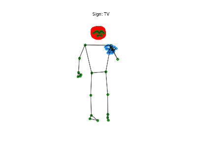
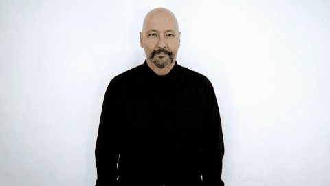

# 🥉 3rd Place Solution - Google ASL Fingerspelling Recognition Competition

## Overview

This repository contains the training pipeline based on our 3rd place solution for the [Google - Isolated Sign Language](https://www.kaggle.com/competitions/asl-signs/overview) competition on Kaggle. The challenge involved building a model to recognize Isolated Sign Language (ISL) gestures from video sequences captured via MediaPipe landmarks.

## Problem Statement

The competition challenged participants to build a computer vision system capable of recognizing isolated sign language gestures in real-world conditions. 




**Technical challenges:**
- Different durations for each gesture
- Missing/incomplete data, frequent landmark occlusions
- Tensorflow Lite models for mobile devices with 40MB size limit
- 250+ gesture classes including letters, numbers, and common signs

## Solution

We used an ensemble of six Conv1D models and two versions of transformers. This approach captures both temporal patterns (Transformers) and local features (Conv1D), improving robustness and accuracy across diverse signing styles and conditions.

### 📐 Model Architectures

#### Conv1D Model Implementation

```python
# Conv1D Model Architecture (Functional API)
def build_conv1d_model(max_len=32, do=0.5):
    # Input layer
    inputs = Input(shape=(max_len, 61, 2))
    x = Reshape((max_len, 61*2))(inputs)
    
    # First Conv block
    x = Conv1D(64, 1, strides=1, padding='valid', activation='relu')(x)
    x = BatchNormalization()(x)
    x = DepthwiseConv1D(3, strides=1, padding='valid', depth_multiplier=1, activation='relu')(x)
    x = BatchNormalization()(x)
    
    # Second Conv block
    x = Conv1D(64, 1, strides=1, padding='valid', activation='relu')(x)
    x = BatchNormalization()(x)
    x = DepthwiseConv1D(5, strides=2, padding='valid', depth_multiplier=4, activation='relu')(x)
    x = BatchNormalization()(x)
    
    # Pooling
    x = MaxPool1D(2, 2)(x)
    
    # Third Conv block
    x = Conv1D(256, 1, strides=1, padding='valid', activation='relu')(x)
    x = BatchNormalization()(x)
    x = DepthwiseConv1D(3, strides=1, padding='valid', depth_multiplier=1, activation='relu')(x)
    x = BatchNormalization()(x)
    
    # Fourth Conv block
    x = Conv1D(256, 1, strides=1, padding='valid', activation='relu')(x)
    x = BatchNormalization()(x)
    x = DepthwiseConv1D(5, strides=2, padding='valid', depth_multiplier=4, activation='relu')(x)
    x = BatchNormalization()(x)
    
    # Global pooling
    x = GlobalAvgPool1D()(x)
    x = Dropout(rate=do)(x)
    
    # Dense layers
    x = Dense(1024, activation='relu')(x)
    x = BatchNormalization()(x)
    x = Dropout(rate=do)(x)
    
    x = Dense(1024, activation='relu')(x)
    x = BatchNormalization()(x)
    x = Dropout(rate=do)(x)
    
    # Output layer
    outputs = Dense(250, activation='softmax')(x)
    
    return Model(inputs=inputs, outputs=outputs)
```

#### Transformer Model Implementation

```python
# Transformer Model Architecture (Functional API)
def build_transformer():
    # Inputs
    frames = Input(shape=(32, 66, 3), name='frames')
    non_empty_frame_idxs = Input(shape=(32,), name='non_empty_frame_idxs')
    
    # Extract x,y coordinates only (drop z)
    x = Lambda(lambda x: x[:, :, :, :2])(frames)
    
    # Split landmarks
    lips = Lambda(lambda x: x[:, :, 0:40, :])(x)      # 40 lip points
    left_hand = Lambda(lambda x: x[:, :, 40:61, :])(x) # 21 hand points
    pose = Lambda(lambda x: x[:, :, 61:66, :])(x)      # 5 pose points
    
    # Landmark-specific embeddings
    lips_embedding = LandmarkEmbedding(256, 'lips')(lips)
    left_hand_embedding = LandmarkEmbedding(256, 'left_hand')(left_hand)
    pose_embedding = LandmarkEmbedding(256, 'pose')(pose)
    
    # Combine embeddings with learnable weights
    x = WeightedAverage()([lips_embedding, left_hand_embedding, pose_embedding])
    
    # Add positional encoding
    x = PositionalEmbedding()(x, non_empty_frame_idxs)
    
    # Transformer blocks (3 blocks, 8 heads each)
    for i in range(3):
        # Multi-head attention
        attn = MultiHeadAttention(
            d_model=256, 
            num_heads=8
        )(x, attention_mask=mask)
        x = Add()([x, attn])  # Residual connection
        
        # Feed-forward network
        ffn = Sequential([
            Dense(256 * 4, activation='gelu'),
            Dropout(0.1),
            Dense(256)
        ])(x)
        x = Add()([x, ffn])  # Residual connection
    
    # Pooling with mask
    x = MaskedGlobalAveragePooling1D()(x, mask)
    
    # Classification head
    x = Dropout(0.5)(x)
    outputs = Dense(250, activation='softmax')(x)
    
    return Model(inputs=[frames, non_empty_frame_idxs], outputs=outputs)
```

### 🏗️ Model Ensemble

#### 1. Transformer Models (3 variants with 5-fold cross-validation)

- Custom MultiHeadAttention implementation for TFLite compatibility
- Two architecture types:
  - **Type 1**: Separate embeddings for each part (lips, hands, pose) - LB 0.77+
  - **Type 2**: Single embedding for whole xyz sequence - LB 0.768
- Separate embeddings for lips (256 units), hands (256 units), pose (256 units), and motion (128 units)
- Positional encoding normalized by frame indices

**Augmentations:**
- **Global**: rotation (-10°, 10°), shift (-0.1, 0.1), scale (0.8, 1.2), shear (-1.0, 1.0), flip for some signs
- **Time-based**: random augment 1-8 frames, random drop frames (fill with 0.0)

**Hyperparameters:** 
- `NUM_BLOCKS=2`, `NUM_HEAD=8`
- `LEARNING_RATE=1e-3`, `OPTIMIZER='AdamW'`
- `EPOCHS=100`
- `LATE_DROPOUT=0.2-0.3`
- `LABEL_SMOOTHING=0.5`

#### 2. Conv1D Models (6 specialized variants)

- Depthwise separable convolutions (DepthwiseConv1D) with depth multipliers 1-4x
- Native TFLite layers for optimal mobile performance
- Multiple preprocessing strategies:
  - **Base model**: lips + hands (21 points each)  
  - **Pose variant**: Adds pose landmarks for body context
  - **Eyes variant**: Incorporates 32 eye landmarks for facial expressions
  - **Sparse variant**: Uses every 2nd eye/lip landmark for efficiency
  - **Single hand**: Only dominant hand with mirroring
  - **96 frames**: Extended sequence length model

### 🔧 Technical Implementations

#### 1. Preprocessing Pipeline

**Landmark extraction strategy** (543 total landmarks → 102 selected):
- **LIPS**: 20 selected mouth landmarks
- **HANDS**: 42 total hand keypoints (21 left + 21 right)
- **POSE**: 8 upper body joints (shoulders, elbows, wrists, hips)
- **EYES**: 32 eye contour points (16 per eye)

**Hand dominance detection and mirroring**:
- Automatic detection of dominant hand per video
- Mirror transformation for left-handed signers
- Ensures consistent feature representation

**Reference point normalization**:
- The input sequence is normalized with shoulder, hip, lip and eyes points
- Uses specific landmarks for coordinate normalization: `[500, 501, 512, 513, 159, 386, 13]`
  - 500, 501: Left and right shoulders from pose landmarks
  - 512, 513: Left and right hips from pose landmarks
  - 159, 386: Key facial landmarks (likely nose bridge or face center points)
  - 13: Another facial landmark (possibly chin or mouth center)
- Creates a stable reference frame using body landmarks that don't move much during signing
- Normalizes all coordinates relative to these reference points, making the model invariant to:
  - Person's position in the frame
  - Distance from camera
  - Body size differences
- Note: We didn't use the depth dimension for normalization

#### 2. Frame Sampling

- **Fixed 32-frame sequences** for consistent input size (96 frames for one model)
- **We didn't throw away frames without hands** but took hand presence into account during TTA
- **Adaptive downsampling** for videos > 32 frames:
  - Frame selection with different probabilities based on hand presence during TTA
  - Preserves diversity of frames in the sequence
- **Smart padding** for videos < 32 frames:
  - Edge padding with random offset to prevent overfitting
  - NaN masking for missing landmarks
  - Random left/right padding during TTA

#### 3. Motion Feature Engineering

**Compute frame-to-frame differences**:
- `(dx, dy)_t = xyz_t - xyz_{t-1}`

**Create motion embedding with 3 channels**:
- `motion_input = (dx, dy, sqrt(dx² + dy²))_t`

**Final embedding is concatenation**:
- `final_embedding = concat(motion_embedding, xyz_embedding)`

**Note**: NaN values are filled with 0.0

#### 4. Landmark-Specific Embeddings with Attention

- Each landmark group has dedicated embedding network
- **Learnable soft attention weights** combine features:
  ```python
  weights = softmax([w_lips, w_hands, w_pose])
  combined = weights[0]*lips + weights[1]*hands + weights[2]*pose
  ```
- Empty landmark handling with trainable embeddings

#### 5. Test-Time Augmentation (TTA)

**TTA strategies for Conv1D models**:
- Random left/right padding for short sequences
- For large sequences: probabilistic frame dropping based on hand presence
- Different landmark combinations for different models:
  - Both hands / only active hand
  - Lips (full or every second point)
  - Eyes (full or every second point)  
  - Top part of pose
- Single hand models: detect dominant hand, mirror if left-handed
- Frame counts: 32 frames (most models) or 96 frames (one model)

**Each Conv1D model uses dual preprocessing at inference**:
```python
x = preprocess_layer[0](inputs)  # Standard preprocessing
x1 = preprocess_layer[1](inputs) # With random frame sampling (r_long=True)
outputs = 0.5*model(x) + 0.5*model(x1)  # Average predictions
```

**Results**: 6 Conv1D models ensemble achieved:
- Public LB: 0.7948
- Private LB: 0.8711

#### 6. Optimized Model Ensemble

**Final ensemble**: 6 Conv1D models + 2 Transformer models  
This combination achieved 3rd place in the competition

**Conv1D models with TTA**:
- `model_96frames` - Long sequence model (96 frames)
- `model_32frames` - Base Conv1D (32 frames)
- `model_32pose` - With pose landmarks
- `model_32eyes` - With eye tracking  
- `model_v0sparse` - Sparse eye landmarks (every 2nd point)
- `model_singlehand` - Single dominant hand model

**Transformer models**:
- `transformer_type1` - Separate embeddings model
- `transformer_type2` - Single embedding model

The ensemble strategy with TTA enabled fast, lightweight inference while maintaining high accuracy on both public and private leaderboards.

### 📊 Data Augmentation Strategies

#### Training-Time Augmentations

**1. Global Augmentations** (Applied to all frames consistently)
- Random rotation, shift, scale applied globally to each frame
- Random small shift added to every point
- Rotation: -10° to 10°
- Shift: -0.1 to 0.1
- Scale: 0.8 to 1.2
- Shear: -1.0 to 1.0
- Flip: applied for some signs

**2. Part Combinations** (Significant score improvement)
- Take hand from one sample and lips from another sample with the same label
- Creates new synthetic training examples
- Helps model learn independent features for different body parts

**3. CutMix Augmentation** (Custom Implementation)
- Mixed samples from different sign language classes
- **Weighted label assignment**:
  - Hand landmarks: 0.7 weight (primary signal)
  - Other landmarks (lips, pose): 0.3 weight (context)
- Helps model learn robust features across different signers

**4. Time-based Augmentations** (Transformer models)
- Random augmentation of 1-8 frames with affine transformations
- Random frame dropping (filled with 0.0)
- Greatly improved transformer model scores

**5. Other Augmentations**
- **Hand Mirroring**: Automatic left/right hand detection per video
- **Late dropout scheduling**: Starts at epoch 80 to prevent early overfitting
- **Zero-mean variants**: Some models trained with μ=0 normalization

#### Test-Time Augmentations (TTA)

- **Dual preprocessing paths** with 50/50 averaging
- **Random frame sampling** (r_long=True) vs deterministic sampling
- **Multiple landmark configurations** (with/without eyes, sparse landmarks)

## Repository Structure

```
Kaggle-Google-Sign-Language-3rd-Place/
├── README.md              # Project documentation
├── main.py               # Main entry point for training and inference
├── visualizer.py         # Visualization utilities
├── tv_sign.gif           # Example sign language animation
├── tv_sign_youtube.gif   # YouTube demo animation
├── core/                 # Core functionality
│   ├── __init__.py
│   ├── config.py         # Configuration settings
│   ├── landmarks.py      # Landmark extraction and handling
│   └── utils.py          # Utility functions
├── data/                 # Dataset files
│   ├── train.csv         # Training metadata
│   └── train_landmark_files/  # MediaPipe landmark parquet files
│       └── 16069/        # Participant folders containing .parquet files
├── models/               # Model architectures
│   ├── __init__.py
│   ├── base.py           # Base model classes
│   ├── conv1d.py         # Conv1D model implementation
│   └── transformer.py    # Transformer model implementation
├── processing/           # Data processing pipeline
│   ├── __init__.py
│   ├── generator.py      # Data generators for training
│   ├── loader.py         # Data loading utilities
│   ├── preprocessing.py  # Preprocessing functions
│   └── statistics.py     # Data statistics and analysis
├── training/             # Training pipeline
│   ├── __init__.py
│   ├── callbacks.py      # Custom callbacks
│   ├── evaluation.py     # Model evaluation metrics
│   ├── losses.py         # Custom loss functions
│   └── trainer.py        # Training orchestration
├── tflite/               # TensorFlow Lite conversion
│   ├── __init__.py
│   ├── converter.py      # TFLite conversion utilities
│   └── wrapper.py        # TFLite model wrapper
└── outputs/              # Model outputs and artifacts
    ├── *.npy             # Preprocessed numpy arrays
    ├── *.h5              # Saved Keras models
    ├── *.tflite          # Converted TFLite models
    ├── conversion_log.txt # TFLite conversion logs
    └── submission.zip    # Competition submission files
```

## Experiments That Didn't Make Final Solution

### 1. Synthetic Data Generation
- Found a paper on generating synthetic 3D hand points parametrized by inner parameters (joint rotations) and camera model
- Created script to generate synthetic hand data
- Attempted to pretrain model to predict hand inner parameters from 3D points
- Planned to use this pretrained model for data preprocessing
- Insufficient time to complete implementation

### 2. Additional Dataset - WLASL
- Trained on WLASL (Word-Level American Sign Language) dataset
- Achieved ~0.005-0.007 increase in local CV score
- Ultimately abandoned and didn't use in final LB submissions

## Contact

Feel free to reach out if you have questions about the implementation or would like to discuss the approach in more detail.